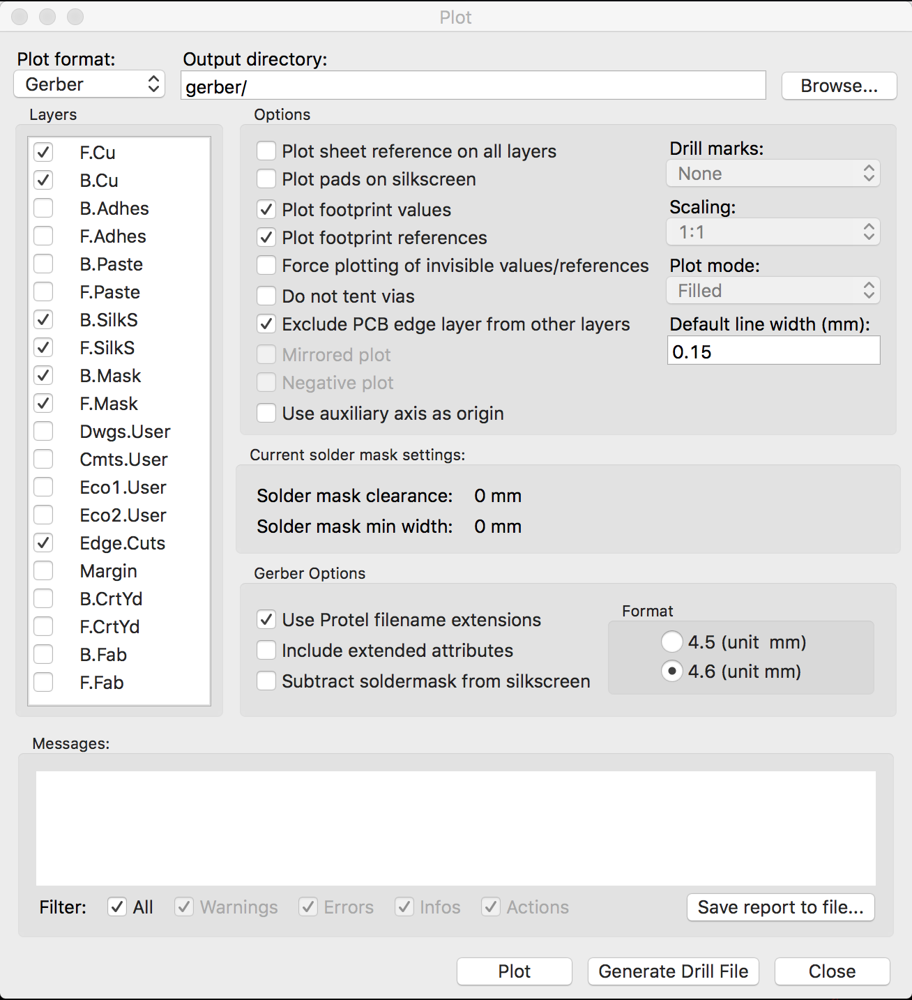
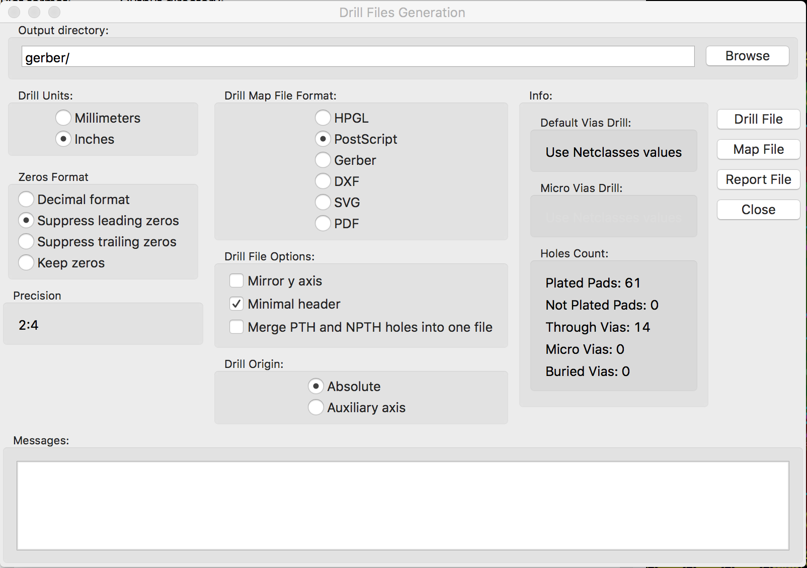

kicad
=====
workspace for [kicad](http://www.kicad-pcb.org/) projects

Links
-----
* A starting point to work with kicad could be the the linked [tutorial](http://store.curiousinventor.com/guides/kicad).
* To convert pictures to silkscreen graphics (in kicad_mod format), I used the following [tool](http://img2mod.wayneandlayne.com/)
* To prepare the generated kicad files for the [Seeedstudio Fusion Service](http://www.seeedstudio.com/service/index.php?r=pcb), follow these [instructions](http://koblents.com/Ches/Original-Work/46-KiCAD---Seeedstudio-Fusion--Getting-Started/).  

Generation of gerber files
--------------------------
*Hi,*
*I had some trouble making a correct submission to the Seeedstudio Fusion service. Just for the sake of documentation* *in case somebody looks for information regarding this topic:*
*From my experience here are the parameters that work well with seeedstudio fusion service:*
*When exporting your PCB layout, select both coper layers, both solder mask layers, both silkscreen layers, and the* *edge cut layer.*
*Select "exclude edges from other layers" (sorry my version of kicad is in french and right now I can't make it work* *in english so the option's name is not necessarily exact).*
*In format, select "4.6"*
*In the Gerber options select the Protel extensions. It will generate the files with the correct extensions* *".GTL",".GTS", ...*

*To create the drill file I used "Units : inches", "Suppress leading* 
*zeros", postscript format (I don't know if that's useful), minimal*
*header", absolute coordinates.*

*Put all the generated files in a Zip archive, it should work. In case*
*it doesn't seeedstudio sends a mail indicating the error and you can *
*re-submit your files.*

**There is no need to rename the files.**

*I worked for me using 2 sided PCBs.*
*Hope it helps*

